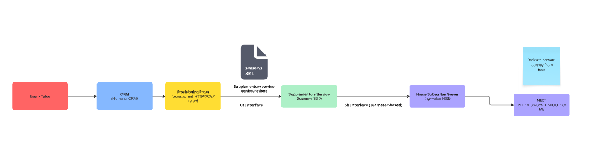

## 1.Information gathering stage

### From Support team
As usual, first port of call would be an orientation call to discover any ongoing issues from the Ops team. 
* How could this process work better for you?

* details of incoming request - frequency, etc. Are there any triggers, like network load, etc?
* who makes these requests? Make sure to understand the full audience. Their needs and technical competence.
* describe the issue or issues as stated by users? Are there more than one? List them. Make sure to catch edge cases.
* What is the resolution? Do you have a standard doc you send out?
* How successful is the resolution?
* Do you get repeat requests from same clients or does the first interaction solve the issue?

### From Engineering team
As usual, first port of call would be an orientation call to discover any ongoing issues from the Ops team. 
* How could this process work better for you?

1. Outline of the process of IMS Core supplementary service provisioning in detail. 

The goal of producing:
* A diagram which outlines basic flow of data/requirements for the set up. This needs to be accurate but intelligible without being an engineer. 
> The goal of this diagram is to align all teams (internal and external) on the high level mental model of the product and process.

* A more detailed diagram which focuses on clarifying where the problem areas are in this flow and indicates the appropriate solutions/documents.
> This will give engineers (internal and external) a reference point for their own implementation and any conversations needed to further clarify. eg: 'we get to step 4 and the connection is rejected'

* A clear step by step flow for each participant. 
> This supplements the previous engineering diagram, outlines numbered steps, provides test scripts and examples for all use cases.

### From Operations team
As usual, first port of call would be an orientation call to discover any ongoing issues from the Ops team. 
* How could this process work better for you?

Taking the engineering diagram and process, we can discuss higher level business processes which encapsulate the engineering. 

The result should be a clarification/enlargement of context for:
1. The high level engineering flow diagram
2. The Step-by-step engineering process

### From General research

# Basic structure.

## Introduction
* What is IMS Core Supplementary service provisioning ? 
* Who should care, how this document helps.
* How to use this doc.

## For everyone
Outline the process from high level, using diagram (this is place holder diagram!)

